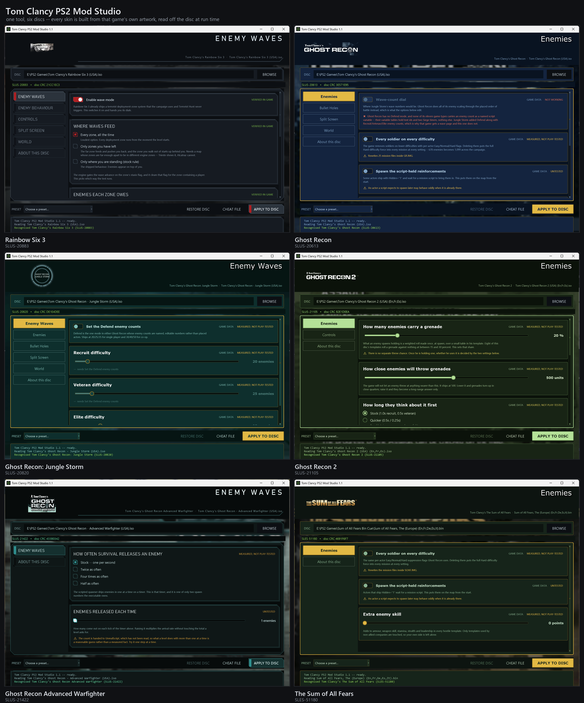
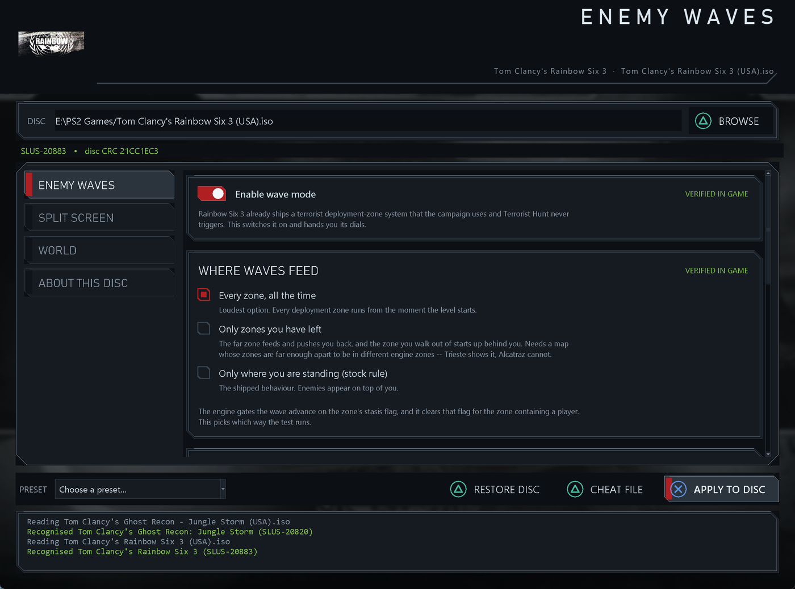
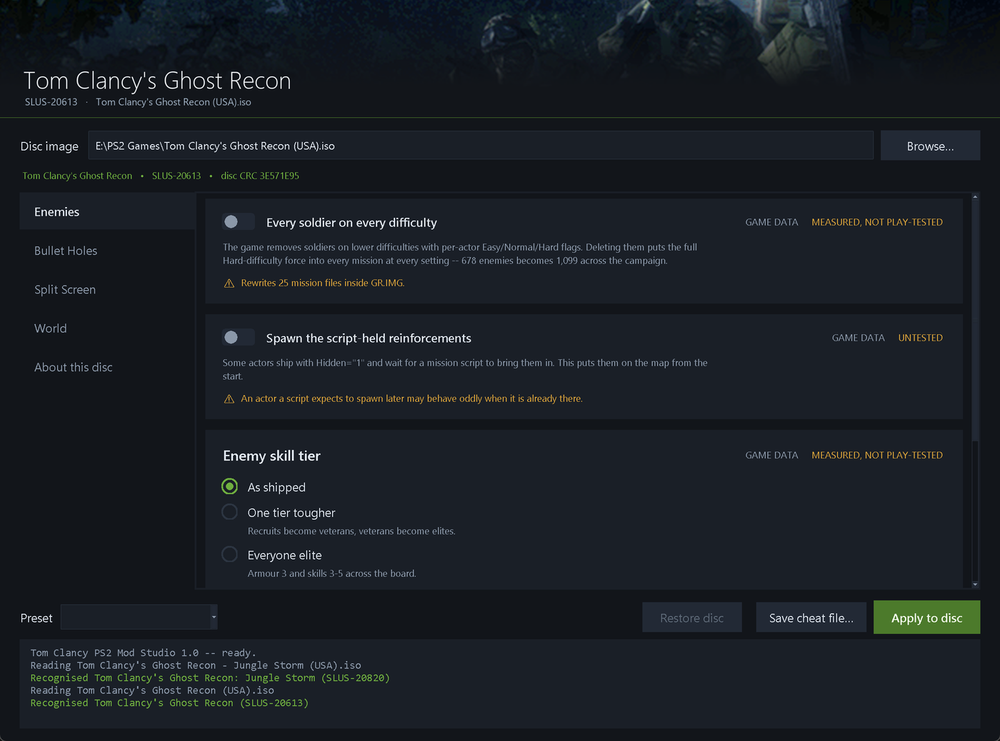
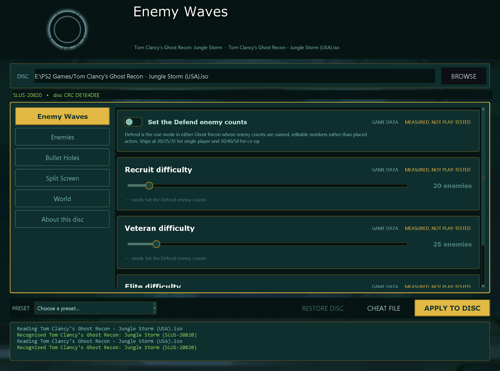

# Tom Clancy PS2 Mod Studio

A Windows tool that patches **Tom Clancy PlayStation 2 disc images in place** and
gives you switches for things the games shipped with turned off.

Point it at an ISO, move some sliders, press **Apply to disc**. Nothing is
rebuilt and no ISO tools are needed. A pristine copy of everything it overwrites
is kept next to the ISO, and **Restore disc** puts it all back.

**It wears the menu of whichever disc you load.** Six discs, six skins, and
each one is built from that game's own artwork: Rainbow Six 3's gunmetal HUD
with its cut corners, letterspaced titles and red selection tab; Advanced
Warfighter's near-black and teal; Ghost Recon's gold-on-navy console shell;
Jungle Storm's the same shell in teal; Ghost Recon 2's lime on drab; Sum of All
Fears in olive. The backdrop and the corner badge are pulled out of your own
disc at run time and cached -- no game data ships with the tool.





---

## What it does today

| Disc | Serial | Enemies | Bullet holes / FX | Split screen |
|---|---|---|---|---|
| Rainbow Six 3 | SLUS-20883 | **wave mode**, fully tunable; grenade carry, throw range, reaction, skill, never-miss range | decal ring, body lifetime | weapon model, impacts, blood, weather, emitters, **player 2 look speed** |
| Ghost Recon | SLUS-20613 | full count, skill tier, skill points | pool size, lifetime, every-surface | effect gates |
| Ghost Recon: Jungle Storm | SLUS-20820 | **Defend wave counts**, full count, skill points | pool size, lifetime, every-surface | effect gates |
| Ghost Recon 2 | SLUS-21105 | grenade carry, throw range, reaction, opening-fire delay, skill, never-miss range, sight radius | — | — |
| Ghost Recon Advanced Warfighter | SLUS-21422 | Survival release rate and batch size | — | — |
| The Sum of All Fears | SLES-51180 | full count, script-held reinforcements, skill points | — | — |

The six discs run two different engines, so what is possible differs sharply
and the tool says which is which on every option.

* **Rainbow Six 3, Advanced Warfighter and Ghost Recon 2 are Unreal builds.**
  Rainbow Six 3's enemies come from a deployment-zone system inside the
  executable, so its options are code patches — and they have been watched
  working in the running game. Ghost Recon 2 is the same disc layout a year
  later (`SP.SOZ`, vokes archives, `.LIN` packages, the same
  `R6GAMESETTINGS.INI` down to the shipped values) but its own overlay has not
  been mapped, so it is offered data options only rather than Rainbow Six 3's
  addresses pointed at a different build.
* **Ghost Recon and Jungle Storm are Red Storm's own engine**, and they keep
  their enemies in **data**: a mission file is XML, one `<Actor>` element is one
  soldier, and nothing in the executable caps how many there are. Those options
  rewrite the game's own mission files. Their *render* options are code patches
  whose addresses came out of Ghost Recon's own symbol table — the disc ships an
  unstripped debug build with 19,496 named functions — but which have not been
  play-tested, and are labelled accordingly.

### Every option carries a badge

* **verified in game** — watched working in the running game.
* **measured, not play-tested** — the change is confirmed in the disc and the
  numbers behind it were measured, but the visible result was not checked.
* **untested** — reasoned from the disassembly. Turn one on at a time.
* **not working** — shipped disabled, with the reason written on it.

A second chip says what the option rewrites: **game data**, **cheat file**, or
nothing extra, meaning the executable.

---

## Rainbow Six 3 — enemy wave mode

The game already contains a terrorist deployment-zone system. The campaign uses
it. Terrorist Hunt never triggers it. This turns it on and hands you its dials.

* **Where waves feed** — every zone all the time, only the zones you have left
  (so the far side of the map pushes you back and the corner you vacate starts
  up behind you), or the stock rule, which is literally "spawn where the player
  is standing".
* **Enemies each zone owes** — 1 to 250, multiplied by the zones on the map.
* **Released per wave** — 1 to 8, capped in practice by how many spawn points
  the zone can reach.
* **Alive before the next wave** — the real volume dial. A zone tops itself up
  until more than this many of its enemies are alive, so steady state per zone
  is roughly this plus the release size. **Set this first**, then the release
  size, then the total.
* **Waves hunt you from the start** — without it a zone waits for a level-script
  trigger that Terrorist Hunt never fires.
* **Spawn across the whole map** — stock, a wave can only use the two or three
  points sitting beside it, so every enemy walks out of one corner. This picks
  from every deployment point in the level, which brings a real mix of enemy
  types with it. *Delivered as a PCSX2 cheat file — see below.*

Which level you pick matters more than any slider:

| Level | Zones | Spread | Spawn points | Verdict |
|---|---|---|---|---|
| **Shipyard** | 2 | 111 x 114 m, wraps the insertion point | 27 | **best** — fighting from the first minute |
| **Alcatraz** | 2 | 19 m apart | 6 | best wave quality, indoors, cheap to draw |
| **Trieste** | 3 | 54–83 m | 4 | the only real triangle, and the heaviest level in the game |
| Island | 2 | 6 m apart | 5 | every zone sits past the halfway point |
| Oil Refinery | 3 | two clusters | 4 | a thin trickle whatever you set |

Alpine Village A, Import/Export A, Penthouse and Training have no zones at all.

## Rainbow Six 3 — split screen

Split screen deliberately switches a pile of things off. These put them back:
**your weapon model** — the engine zeroes a global the moment it detects split
screen, and that global has exactly one writer in the whole overlay — plus
**bullet impact decals** on the world and on people, **impact puffs and sparks**,
**blood effects**, **rain and snow**, and the **fire and water emitters** that
levels flag "hide in split screen". There are six of those per level and they
are always the ones standing next to the players.

**AI teammates in split screen is shipped disabled.** Four separate attempts all
hang the level load, and the four hang states are byte-identical, so the cause
is upstream of every edit tried. The option is visible with that written on it
rather than quietly missing.

## Rainbow Six 3 — world

* **Bullet holes kept on screen** — 32 to 160. Footprints and wall hits share a
  fixed-size ring buffer; raising it is the only way to keep more, and it cannot
  be made unlimited.
* **How long bodies stay** — stock (about 3 seconds), 15, 30, 60, or never.

---





## Ghost Recon and Jungle Storm — enemies

Both games scale difficulty with three per-actor attributes in the mission XML:

```
<Actor ... File = "m02_rec_ak47_2.atr" Easy = "0"/>
```

`Easy = "0"` means *this soldier is removed on Easy*. There is no `"1"` form
anywhere in either game; absence of the attribute means present. Deleting them
puts the full Hard-difficulty force into every mission at every setting:

| | Easy | Normal | Hard / Elite |
|---|---:|---:|---:|
| Ghost Recon, across 28 missions | 678 | 959 | **1,099** |
| Jungle Storm, across 21 missions | 657 | 804 | **955** |

* **Spawn the script-held reinforcements** — actors that ship `Hidden="1"`
  waiting on a mission script go onto the map from the start.
* **Enemy skill tier** (Ghost Recon only) — it names its templates by tier,
  `m02_rec_ak47_2.atr`, and the tiers really are different numbers: recruit at
  armour 1 and skills 1–3, veteran at 2 and 2–4, elite at 3 and 3–5. Jungle
  Storm dropped that scheme, so the option is not offered there.
* **Extra enemy skill** — adds to armour, weapon skill, stamina, stealth and
  leadership. Scoped to templates used by non-allied companies only, and the two
  sets are completely disjoint in both games — 568 hostile against 17 other in
  Ghost Recon, 274 against 24 in Jungle Storm, zero overlap — so your own squad
  is never touched.

**Jungle Storm's Defend mode is the one place either game names its enemy
counts.** `Recruit / Veteran / Elite enemy count` ship at 20/25/35 in single
player and 30/40/50 in co-op, and the tool edits them directly.

What is *not* reachable: mission wave **timing**. Every mission's script variable
table is empty, so a timer like "Camp Wave 2 Timer" is a constant baked into a
compiled node graph that has not been decoded.

## Ghost Recon and Jungle Storm — bullet holes and effects

Both ship a 20-entry bullet-hole ring, a 30-second lifetime (2 seconds on three
surface types), and an early-out that draws nothing at all on a surface the decal
code does not recognise. All three are adjustable. The split-screen render path
drops bullet holes, foliage and birds; the safe half of those gates — the
creation and update side — is exposed, and the gate that also skips the second
viewport's setup was deliberately left out.

**Ghost Recon has a first-person camera but no view model.** Entering first
person calls `Hide()` on your own soldier and draws nothing in its place, and a
search of all 38,722 symbols turns up only the two `IsFirstPerson` predicates.
The tool can skip that `Hide` so you at least see your own body from eye height;
there is no arms-and-weapon mesh anywhere in the game to show instead.

---

## Using it

1. Download `ModStudio.exe`. No install, no Python.
2. **Close your emulator** — it keeps the ISO locked.
3. Browse to your disc image. The tool identifies it from `SYSTEM.CNF` and checks
   the disc CRC against the build the options were measured on; if it does not
   match you get a warning and the code options are refused, because patching
   addresses on a different revision corrupts it.
4. Pick a preset or set things by hand, then **Apply to disc**.

### The cheat file

One option — Rainbow Six 3's map-wide spawn points — cannot go into the disc. It
is a code cave, and a cave written once into the overlay image does not survive a
level load; a cheat file rewrites it every frame, which is what makes it work.
**Save cheat file…** writes a `.pnach` named after the disc CRC.

Drop it in your PCSX2 `cheats` folder, enable cheats for the game, and **restart
the emulator** so the file is read. The patch lines are deliberately unlabelled:
a named `[section]` added while the game is already running never enters PCSX2's
enabled set, and there is nothing in the interface to tell you.

### Undoing it

**Restore disc** puts back whatever was replaced — the compressed overlay from a
byte-exact copy, individual executable words from their recorded originals, and
every rewritten data file at the exact offset it came from. Backups are taken
automatically the first time the tool sees an untouched disc, so open a stock ISO
once before you start experimenting.

You can also just re-apply with different settings. Every write rebuilds from the
pristine image rather than from whatever is on the disc now, so turning an option
off really removes it.

---

## Command line

The same binary, the same engine:

```
ModStudio.exe --cli info   "R6 3.iso"
ModStudio.exe --cli list   "R6 3.iso"
ModStudio.exe --cli plan   "R6 3.iso" --preset heavy
ModStudio.exe --cli apply  "R6 3.iso" --set wave_trigger=4 --set wave_size=2
ModStudio.exe --cli cheat  "R6 3.iso" --out 21CC1EC3.pnach
ModStudio.exe --cli revert "R6 3.iso"
ModStudio.exe --cli apply  "Ghost Recon.iso" --set gr_all_difficulties=true
ModStudio.exe --cli files  "Ghost Recon.iso" --grep "\.MIS$"
ModStudio.exe --cli art    "R6 3.iso" --out .\art
```

`plan` shows exactly which words and which data files would change, and writes
nothing.

---

## Building from source

```
pip install pillow pyinstaller
python ModStudio.py            # run the window
python build_exe.py            # produce dist\ModStudio.exe
python tests\run_tests.py --iso "R6 3.iso" --gr "Ghost Recon.iso" --js "Jungle Storm.iso"
```

Python 3.10+. The suite builds small synthetic discs from real stock data and
exercises apply, re-apply and restore against them; the Ghost Recon archive
tests run against the real discs through a write shadow, so no retail file is
ever opened for writing.

---

## How it works

| module | what |
|---|---|
| `tcps2/iso.py` | ISO9660 directory and raw sector access |
| `tcps2/soz.py` | Rainbow Six 3's `.SOZ` overlay: `u32 size` + one zlib stream in a fixed extent |
| `tcps2/overlay.py` | uniform word access to both a `.SOZ` and a plain ELF |
| `tcps2/vokes.py` | the archive behind `VOKES*.IMG` and `GR.IMG` / `MENU.IMG`, including a relocating writer |
| `tcps2/rselzo.py` | Red Storm's chunked LZO1X container, decoder **and** encoder |
| `tcps2/transforms.py` | the length-preserving XML edits |
| `tcps2/dataedit.py` | applying, verifying and undoing data edits |
| `tcps2/rsb.py`, `art.py` | the games' own textures and screens, used to skin the window |
| `gui/skins.py` | one palette and chrome painter per disc |
| `tcps2/games/*.py` | one profile per disc: its options and the stock word at every address it touches |
| `tcps2/engine.py` | plan, apply, verify, restore |

Two things are worth calling out because they are what make writing to these
discs safe at all.

**Nothing grows.** A vokes archive entry has an explicit offset and size, so a
file that no longer fits its slot is relocated into free space and its old run is
released back into the pool. Every archive ends with 64 KB of zero padding, and
every candidate run is read and required to be all zeros before it is used —
Ghost Recon's `GR.IMG` has a 6 MiB hole that no entry points at and which is full
of real data, so "unreferenced" is not the same as "free".

**Every data edit preserves the file's byte length**, padding with spaces where
it removes something. The compressed container is a chain of 16 KB chunks, so a
length-preserving edit lets every untouched chunk be copied across verbatim and
only the chunks that actually changed pay for this encoder being a shade looser
than the one Red Storm shipped with.

Every patch site's stock word is asserted before anything is written, and
afterwards the overlay is read straight back off the disc and the words counted.
If they do not match, the tool says so instead of claiming success.

`docs/PATCHES.md` lists every Rainbow Six 3 address, what is at it, and why;
`docs/PATCHES-GHOSTRECON.md` does the same for the other two, and documents
the archive and compression formats.

## Credits and scope

This edits your own legally-obtained disc image. No game data is redistributed.
